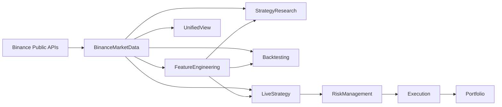
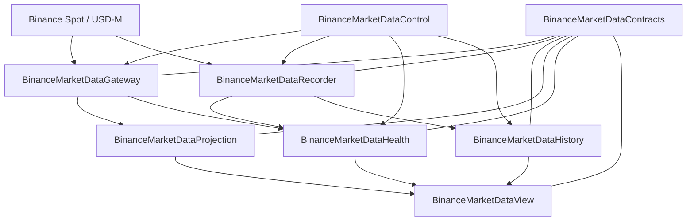
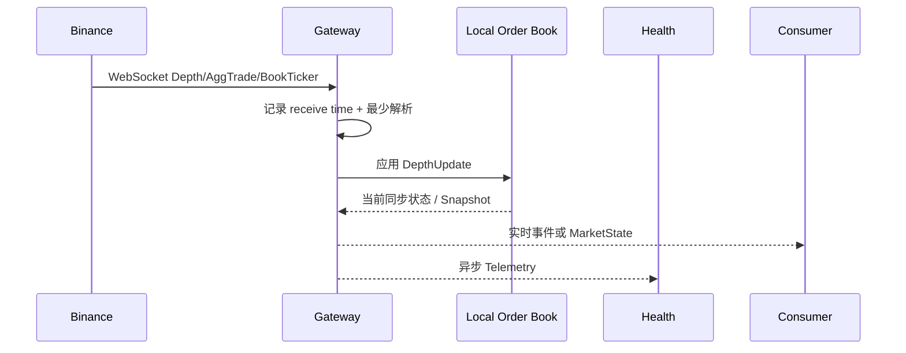
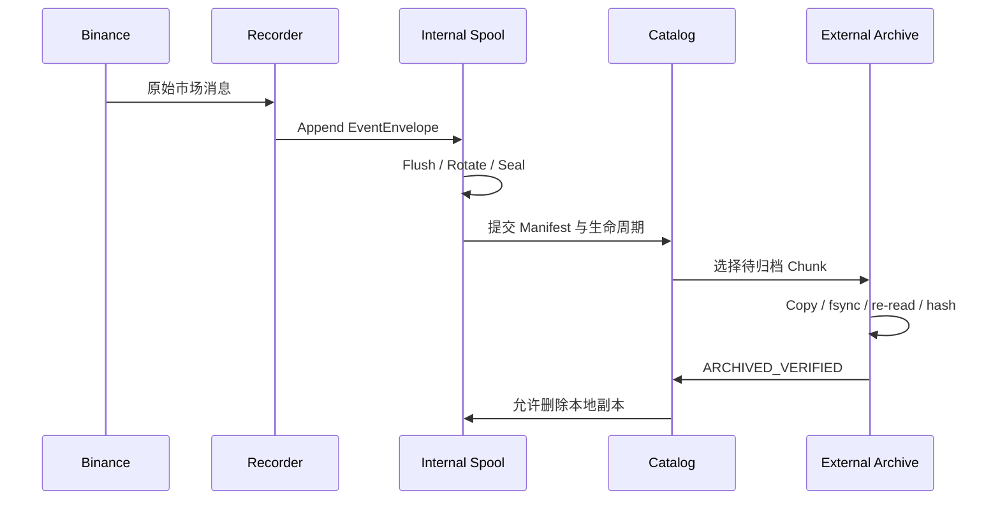
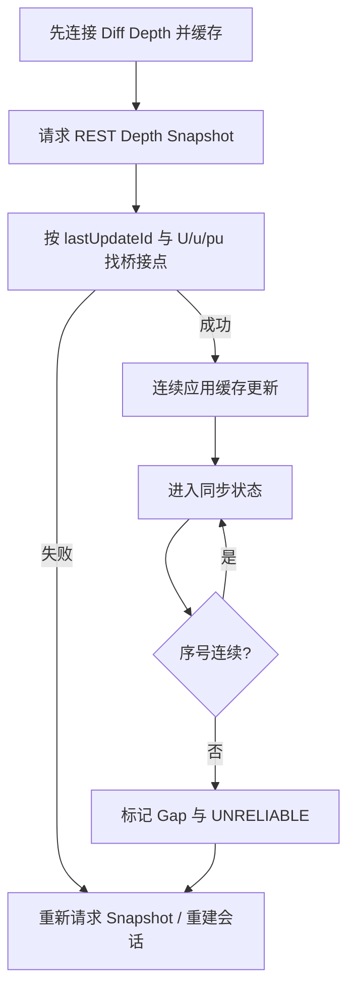
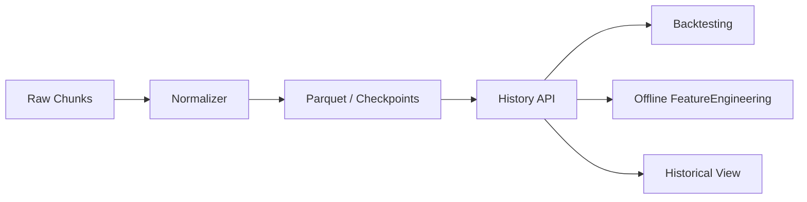

# BinanceMarketData 持续架构文档

> **文档类型**：Living Architecture Document（持续演进的架构文档）  
> **模块**：BinanceMarketData  
> **状态**：Draft / 待审核  
> **版本**：0.2.0
> **最后更新**：2026-08-05
> **主要读者**：软件架构师、开发者、测试人员、运维人员、量化研究人员、AI 编码代理  
> **事实来源**：当前架构讨论、Binance 官方接口语义、各子模块实际代码与 ADR  
> **维护原则**：文档与代码同库、随架构变更更新；重要决策另写 ADR，不在本文中抹去历史

---

## 0. 如何使用本文档

本文档是 `BinanceMarketData` 模块的长期架构入口，用于让不同开发者、不同团队以及不同 AI 模型在进入项目时快速建立一致理解。

本文档主要回答：

1. `BinanceMarketData` 负责什么，不负责什么；
2. 它由哪些子模块组成；
3. 每个子模块解决什么问题；
4. 外部输入与对外输出是什么；
5. 模块之间通过什么合同协作；
6. 实时数据、历史数据和健康状态如何流动；
7. 系统需要满足哪些质量目标；
8. 出现故障时应如何降级和恢复；
9. 哪些设计已经确定，哪些仍待决定。

### 推荐阅读顺序

1. 本文第 1～5 节：建立整体认识；
2. 第 6～8 节：理解合同、运行流程和数据生命周期；
3. 第 9～13 节：理解质量、故障、部署和安全；
4. `docs/adr/`：理解重要决策为何如此；
5. 对应子模块自身的 README、合同与测试。

### 本文档不替代

- Binance 官方 API 文档；
- 子模块的代码级 API 文档；
- JSON Schema / Protobuf / Pydantic 合同；
- ADR；
- 运维手册；
- 测试计划；
- 策略与回测文档。

---

# 1. 模块定位

## 1.1 一句话定义

`BinanceMarketData` 是量化交易系统中的 **Binance 市场数据领域模块**，负责接入、记录、整理、查询、分发、展示并监测所有来自 Binance 的市场事实。

## 1.2 它解决的核心问题

`BinanceMarketData` 应统一回答以下问题：

- Binance 现在发生了什么？
- Binance 历史上发生过什么？
- 某个时刻的订单簿、成交和报价状态是什么？
- 当前数据是否及时、连续、完整、可信？
- 实时策略如何以尽量低的延迟获得数据？
- 回测和研究如何获得可验证、可重放的历史数据？
- 人和运维系统如何观察数据与系统健康？
- 各消费者如何在不依赖内部文件布局和实现细节的情况下读取数据？

## 1.3 模块边界

### 模块负责

- Binance Spot 公共市场数据；
- Binance USD-M Perpetual 公共市场数据；
- WebSocket / REST 市场数据接入；
- 原始事件持久化；
- 本地订单簿重建；
- 历史查询与重放；
- 低延迟实时数据分发；
- 策略无关的市场状态投影；
- 数据质量、延迟、缺口和同步状态；
- 数据相关的可视化与运维控制。

### 模块不负责

- 新闻、链上、社交媒体等非 Binance 数据；
- Alpha 因子和预测性特征；
- 预测价格涨跌；
- 策略决策；
- 回测交易逻辑；
- 风险审批；
- 账户、仓位和订单；
- API Key、签名和真实下单；
- 投资组合管理。

### 与其他顶层模块的关系



---

# 2. 架构目标与优先级

## 2.1 核心质量目标

按优先级排列：

1. **正确性**：市场事件、时间、序号和字段语义必须正确；
2. **可证明的完整性**：缺口、重复、乱序和不可靠区间必须显式记录；
3. **实时性**：Gateway 面向实时消费者提供尽可能低且稳定的延迟；
4. **可恢复性**：进程、网络和存储故障后可以恢复，不伪造连续性；
5. **可重放性**：同一历史数据与排序规则应产生确定结果；
6. **故障隔离**：Recorder、Gateway、Health、View 等互不无理由拖垮；
7. **可演进性**：合同、数据格式和实现可以版本化升级；
8. **可观测性**：能够解释数据是否可用、延迟在哪里、错误发生在哪里；
9. **可移植性**：先支持 macOS，后续支持 Ubuntu；
10. **安全性**：市场数据模块不持有交易权限和账户密钥。

## 2.2 明确的取舍

- Recorder 优先可靠性，不追求最低延迟；
- Gateway 优先实时性，不承担历史持久化事务；
- Health 是异步观察者，不进入 Gateway 的关键热路径；
- View 只展示公开读模型，不读取内部数据库和原始文件；
- 原始数据不可变，派生数据可重新生成；
- 对不可靠数据，宁可拒绝使用，也不静默填补或假装完整。

---

# 3. 系统上下文

## 3.1 外部输入

### Binance Spot

- WebSocket Streams；
- REST Market Data；
- 历史公开归档。

### Binance USD-M Perpetual

- WebSocket Streams；
- REST Market Data；
- 历史公开归档。

### 当前优先市场

- `BTCUSDT Spot`
- `BTCUSDT USD-M Perpetual`

### 当前核心流

- Diff Depth；
- AggTrade；
- BookTicker；
- REST Depth Snapshot（仅初始化、恢复和校验）。

### 后续辅助数据

- Mark Price；
- Index / Premium Index；
- Funding Rate；
- Open Interest；
- Liquidation Events；
- Exchange Information 与交易规则。

## 3.2 外部消费者

- FeatureEngineering；
- StrategyResearch；
- Backtesting；
- LiveStrategy；
- UnifiedView；
- 运维与告警系统；
- 数据审计工具；
- 临时研究脚本。

---

# 4. 子模块总览



建议的逻辑子模块：

1. `BinanceMarketDataContracts`
2. `BinanceMarketDataRecorder`
3. `BinanceMarketDataGateway`
4. `BinanceMarketDataHistory`
5. `BinanceMarketDataProjection`
6. `BinanceMarketDataHealth`
7. `BinanceMarketDataView`
8. `BinanceMarketDataControl`

这些是逻辑职责，不代表必须形成八个仓库、八个数据库或八个进程。

---

# 5. 子模块职责

## 5.1 BinanceMarketDataContracts

### 解决的问题

防止各模块对市场、时间、序号、价格、数量、健康状态和数据版本产生不同解释。

### 负责

- 公共数据类型；
- Schema 版本；
- 单位和精度；
- 时间语义；
- 唯一标识；
- 质量标记；
- 兼容规则；
- 错误与状态代码；
- 序列化格式约定。

### 不负责

- 网络连接；
- 业务流程；
- 持久化；
- 数据计算；
- 界面。

### 主要合同候选

- `DepthUpdate`
- `AggTrade`
- `BookTicker`
- `ExchangeDepthSnapshot`
- `LocalOrderBookSnapshot`
- `MarketStateSnapshot`
- `HistoricalDatasetDescriptor`
- `DataHealthSnapshot`

### C-M4-001 C++ 包设计

Contracts 当前拥有 `.proto` 源文件、Python 生成物和 Wire Contract 语义。面向 Projection
M4 的 Contracts-owned、可安装、版本化 C++ Protobuf message package 架构已经批准，但尚未实现：

- C-M4-001 Design：**APPROVED**；
- ADR-0009：**ACCEPTED**；
- External Architecture Review：**APPROVED**；
- Architecture blockers：**0**；
- C-M4-001 Implementation：**NOT STARTED**；
- C-M4-001：**OPEN / BLOCKING**；
- 设计文档：`docs/C-M4-001_CPP_PROTOBUF_PACKAGE_DESIGN.md`；

当前仍不存在 C++ package、generated message library、exported CMake target、Conan recipe、
schema fingerprint digest 或 package revision。未来 message package 与 gRPC/Gateway runtime
保持独立；Projection Core 不依赖 Protobuf。Projection M4 Implementation：**NOT STARTED / BLOCKED**。

---

## 5.2 BinanceMarketDataRecorder

### 解决的问题

可靠保存 Binance 当时实际发送的市场事件，使数据可验证、可恢复和可重放。

### 负责

- 独立 WebSocket / REST 采集；
- 原始 payload 和多时间戳记录；
- 有界队列；
- 顺序追加写入；
- Chunk 轮换与封口；
- CRC / Hash / Manifest；
- Catalog；
- 崩溃恢复；
- 外置目录长期归档；
- Raw 到 Normalized 数据构建；
- 历史 Replay 基础能力；
- 每日输入输出统计。

### 不负责

- 为策略提供最低延迟实时流；
- 实时图表；
- 策略特征；
- 交易。

### 核心原则

- Raw 不可变；
- 缺口显式；
- 允许 Raw 层存在重复；
- 删除内部副本前必须验证外部副本；
- 外置设备不存在时仍能本地记录。

---

## 5.3 BinanceMarketDataGateway

### 解决的问题

向同机或跨设备的实时消费者提供低延迟、统一、带质量状态的 Binance 实时数据。

### 负责

- 独立 Binance 实时连接；
- 最少必要的解析；
- 本地订单簿实时重建；
- 实时事件分发；
- 当前市场状态维护；
- 消费者订阅；
- 慢消费者隔离；
- 状态快照；
- 实时连接轮换与恢复；
- 发布延迟统计。

### 不负责

- fsync；
- Raw 历史归档；
- Parquet；
- 长期存储；
- 复杂策略特征；
- 下单。

### 第一版建议

Recorder 和 Gateway 独立连接 Binance，以获得故障隔离，并由 Health 对比两条数据通道。

---

## 5.4 BinanceMarketDataHistory

### 解决的问题

让研究、回测和界面能够读取历史数据，而不依赖 Recorder 的内部目录、Catalog 表和外置盘路径。

### 负责

- 数据集发现；
- 时间覆盖查询；
- 数据完整度查询；
- Gap 区间；
- Dataset 版本；
- 历史事件读取；
- 历史订单簿重放；
- Checkpoint Seek；
- Bar、Trade、Depth 查询；
- 数据来源追踪。

### 不负责

- 写 Raw；
- 修改历史数据；
- 策略回测；
- 特征计算；
- 实时流。

---

## 5.5 BinanceMarketDataProjection

### 状态

**[待审核] 是否作为独立模块保留。**

### 解决的问题

将原始市场事件转换为策略无关、确定性的市场表示，避免每个消费者重复实现基础计算。

### 可以负责

- 本地订单簿；
- Best Bid / Ask；
- Mid Price；
- Spread；
- Microprice；
- Top-N Depth；
- 1 秒 / 1 分钟 OHLCV；
- 成交 Tape；
- Signed Trade Volume（仅按公开方向规则）；
- Spot–Perpetual 当前 Premium；
- 当前 Mark / Index / Funding / OI 状态组合。

### 不应负责

- RSI、MACD 等策略指标；
- Z-score、历史百分位等带研究窗口的特征；
- 上涨概率；
- Alpha；
- 买卖信号；
- 目标仓位。

### 边界判断

若输出只是“市场事实的另一种确定性表示”，属于 Projection；  
若输出带有预测假设、训练参数或策略目的，属于 FeatureEngineering。

---

## 5.6 BinanceMarketDataHealth

### 解决的问题

判断数据是否及时、完整、连续、同步、可信，以及问题发生在何处。

### 负责

#### 连接健康

- DNS、TLS、WebSocket；
- Ping / Pong；
- 重连；
- 24 小时连接轮换；
- 最后消息时间；
- 心跳。

#### 延迟健康

- Exchange Event Time → Receive Time；
- Receive Time → Gateway Publish Time；
- Consumer End-to-End Delay；
- p50 / p95 / p99。

#### 序列健康

- `U / u / pu` 连续性；
- 重复；
- 乱序；
- Gap；
- Resync。

#### 订单簿健康

- 是否同步；
- 是否 crossed；
- 是否为空；
- Best Bid / Ask 是否与 BookTicker 一致；
- Snapshot 与 Diff 是否桥接成功。

#### 双通道一致性

- Recorder 与 Gateway 最后事件；
- Update ID 差异；
- Trade ID 差异；
- Mid Price 差异；
- 消息速率差异；
- 一方停滞。

#### 系统资源

- 队列；
- CPU；
- 内存；
- 文件描述符；
- 磁盘；
- Archive Backlog；
- 写入和查询延迟。

### 对外输出

- `HEALTHY`
- `DEGRADED`
- `UNRELIABLE`
- `UNAVAILABLE`

### 关键原则

Health 不阻塞 Gateway 热路径；它异步消费 Telemetry，并向 Risk 与 View 输出判断。

---

## 5.7 BinanceMarketDataView

### 解决的问题

为开发者、研究者和运维人员展示 BinanceMarketData 模块内部的实时、历史和健康状态。

### 负责的视图

#### 实时市场

- 价格；
- Order Book；
- Trade Tape；
- Spread；
- Mid / Microprice；
- Spot–Perpetual Premium；
- Mark / Funding / OI。

#### 历史数据

- 时间覆盖；
- 每日消息量与流量；
- 历史成交与盘口；
- Gap；
- Dataset 版本；
- 数据 Lineage。

#### 数据健康

- 连接；
- 延迟；
- 心跳；
- 序号；
- 同步；
- Recorder / Gateway 一致性；
- 故障时间轴。

#### 存储与 Recorder

- Raw 写入；
- Sealed Chunk；
- 归档；
- 外置存储；
- 剩余空间；
- 容量预测。

### 不负责

- 直接连接 Binance；
- 直接打开 SQLite；
- 扫描 Raw 文件；
- 重建订单簿；
- 计算 Health；
- 运行策略；
- 下单。

### 建议结构

`View Frontend → View Backend / BFF → 各模块公开 Read API`

---

## 5.8 BinanceMarketDataControl

### 状态

**[待审核] 应定义为运维控制面，还是分散到各子模块。**

### 解决的问题

统一执行与“市场数据系统运维”相关的受控命令。

### 候选职责

- 启停服务；
- 查看状态；
- 重载非破坏性配置；
- 注册 / 注销归档目录；
- 手动触发归档；
- 安全弹出外置盘；
- 触发数据校验；
- 触发订单簿 Resync；
- 切换消费者订阅；
- 蓝绿部署；
- 生成诊断包。

### 不负责

- 交易命令；
- 策略启停；
- 风险参数；
- 账户操作。

### 设计要求

Control 必须通过各模块公开命令接口执行，不能直接篡改其内部数据库和文件。

---

# 6. 对外输出合同

## 6.1 DepthUpdate

表示 Binance 订单簿某些价格档的最新数量更新。

关键字段：

- market；
- symbol；
- first / final / previous update ID；
- bids；
- asks；
- exchange event time；
- receive time；
- source connection；
- quality flags。

注意：数量表示更新后的数量，不是增减量；数量为 0 表示删除价格档。

---

## 6.2 AggTrade

表示一个主动订单在同一价格等条件下形成的聚合成交。

关键字段：

- aggregate trade ID；
- price；
- quantity；
- first / last trade ID；
- trade time；
- buyer is maker；
- receive time。

用途：

- 成交 Tape；
- OHLCV；
- 主动买卖量；
- VWAP；
- 历史 Replay。

---

## 6.3 BookTicker

表示当前最优买一、卖一及其数量。

关键字段：

- best bid price / quantity；
- best ask price / quantity；
- update ID（若产品提供）；
- receive time。

用途：

- Spread；
- Mid；
- Top-of-book；
- 本地订单簿第一档校验。

---

## 6.4 ExchangeDepthSnapshot

表示 Binance REST 在请求时返回的有限深度订单簿快照。

用途：

- 本地订单簿初始化；
- Gap 后恢复；
- 状态校验。

它不是持续的完整 WebSocket 快照流。

---

## 6.5 LocalOrderBookSnapshot

表示 Gateway 或 Replay 根据 ExchangeDepthSnapshot 与连续 DepthUpdate 在本地重建出的某一时刻订单簿。

关键字段：

- source；
- last update ID；
- bids / asks；
- depth limit；
- generated time；
- synchronized；
- last gap；
- quality flags。

---

## 6.6 MarketStateSnapshot

表示当前市场的策略无关综合状态。

可包含：

- Best Bid / Ask；
- Mid；
- Spread；
- Microprice；
- 最近成交；
- Top-N Depth；
- Mark / Index；
- Funding；
- OI；
- 数据新鲜度；
- Order Book 同步状态。

不得包含：

- 预测收益；
- 上涨概率；
- 买卖建议；
- Alpha；
- 目标仓位。

---

## 6.7 HistoricalDatasetDescriptor

表示一个可查询、可重放、可验证的历史数据集描述，而不是把整个数据集装入一个对象。

关键字段：

- dataset ID；
- market；
- symbol；
- streams；
- start / end；
- schema version；
- producer version；
- source manifests；
- gap count / intervals；
- partition information；
- manifest hash；
- query / replay capabilities。

---

## 6.8 DataHealthSnapshot

表示某市场数据在某一时刻是否可安全使用。

关键字段：

- overall state；
- connection；
- last message age；
- receive / publish latency；
- sequence gaps；
- resync；
- book synchronized；
- Recorder alive；
- Gateway alive；
- reason codes；
- observed time。

---

# 7. 关键运行流程

## 7.1 实时 Gateway 流程



## 7.2 Recorder 流程



## 7.3 本地订单簿同步



## 7.4 历史消费



---

# 8. 数据生命周期与时间语义

## 8.1 数据层级

1. **Raw**：交易所原始事实，不可变；
2. **Normalized**：规范字段与分区，可重建；
3. **Projection**：策略无关的市场状态；
4. **Feature**：带研究假设的预测输入，属于 FeatureEngineering；
5. **Experiment / Backtest**：属于研究和回测模块。

## 8.2 必须区分的时间

- Exchange Event Time；
- Exchange Trade / Transaction Time；
- Local Receive Wall Time；
- Local Monotonic Time；
- Gateway Publish Time；
- Consumer Receive Time；
- Historical Replay Clock。

禁止只用一个含义模糊的 `timestamp`。

## 8.3 排序规则

历史 Replay 必须明确选择：

- Receive-time ordering；
- Exchange-time ordering；
- Tie-breaker；
- 缺失时间的处理；
- 重复事件的处理；
- Gap policy。

排序规则必须版本化。

## 8.4 完整性语义

数据不能只有“有 / 无”，应至少区分：

- COMPLETE；
- COMPLETE_WITH_DUPLICATES；
- DEGRADED；
- GAP_PRESENT；
- UNRELIABLE；
- UNKNOWN。

---

# 9. 模块协作原则

## 9.1 版本化合同

所有跨模块对象必须有：

- schema version；
- producer；
- consumer；
- ID；
- 时间语义；
- 单位；
- 质量状态；
- 兼容策略。

## 9.2 禁止共享内部实现

- View 不读取 Catalog；
- Strategy 不读取 Raw 文件；
- History 不暴露 Archive mountpoint；
- Health 不直接修改 Gateway 状态；
- Control 不直接改数据库；
- Consumer 不依赖 Recorder 内部类。

## 9.3 慢消费者隔离

每个 Gateway 消费者有独立有界队列。

可能的积压策略：

- 实时策略：断开或显式标记缺口；
- View：丢弃旧画面，只保留最新状态；
- Health：允许聚合和降采样；
- Recorder：使用独立连接，不依赖 Gateway 队列。

## 9.4 幂等与重复

- Raw 层允许重复；
- Normalized 层按明确身份确定性去重；
- 不能用“看起来相同”作为去重标准；
- 蓝绿升级重叠区必须可识别。

---

# 10. 部署与语言边界

## 10.1 逻辑模块不等于进程

- Domain：BinanceMarketData；
- Logical Module：Recorder、Gateway、Health 等；
- Package：Python / Go / C++ 代码组织；
- Process：独立运行与故障边界；
- Deployment：实际运行在哪台设备。

## 10.2 第一版建议部署

- `BinanceMarketDataRecorder`：独立进程；
- `BinanceMarketDataGateway`：独立进程；
- `BinanceMarketDataHealth`：独立进程或与 Gateway 同机；
- `BinanceMarketDataView`：后期；
- `History`：库或按需服务；
- `Projection`：可内嵌 Gateway / History，先不强制独立进程；
- `Control`：CLI + 运维接口。

## 10.3 跨设备通信

gRPC Server Streaming + Protobuf 是 Gateway 向消费者分发实时数据的**首选跨设备协议**。
Protobuf 作为线上合同（wire contract），提供语言无关的结构化序列化，确保 C++、Rust、Go、
Python Consumer 共享相同的消息定义。Gateway 实现语言未由本仓库决定，将另行通过 ADR 确定。

### 同进程

- 函数 / 对象调用。

### 同机不同进程

- Unix Domain Socket；
- localhost TCP；
- gRPC；
- Shared Memory（只有测量后需要）。

### 跨设备

- gRPC / Protobuf（**主要推荐**）；
- TCP；
- WebSocket（适合 View / 浏览器消费者）；
- HTTP（适合查询与控制）。

### 注意事项

- **浏览器消费者**不直接使用 gRPC。浏览器通过 WebSocket 或 HTTP 接入 View Backend / BFF，由 View Backend 负责协议转换，而非 Gateway。
- **生成的 `.proto` 代码**（Python stubs 等）**不得手动编辑**。生成代码位于 `src/binance_market_data/`，由 `python -m binance_market_data_contracts.proto_codegen` 自动生成。
- 第一版不引入 Kafka、Kubernetes 或分布式一致性系统。

## 10.4 多语言原则

不同语言必须共享**线上的合同**，而不是共享某种语言的内部类。

例如：

- Schema：Protobuf / JSON Schema；
- 数据集：Parquet / Arrow；
- 事件日志：已冻结的二进制格式；
- API：gRPC / HTTP / WebSocket。

---

# 11. 故障与降级

必须明确处理：

- WebSocket 断开；
- 连接满 24 小时；
- Ping / Pong 异常；
- REST Snapshot 失败；
- Depth 序号 Gap；
- JSON 错误；
- 队列满；
- 磁盘空间不足；
- 写入失败；
- 外置盘拔出；
- 校验失败；
- Gateway 慢消费者；
- Recorder / Gateway 数据分歧；
- 系统睡眠与唤醒；
- 时钟漂移；
- 进程崩溃；
- 蓝绿升级失败。

### 默认安全原则

- 数据不可靠时，Health 输出 `UNRELIABLE`；
- LiveStrategy / Risk 应禁止新增仓位；
- Recorder 故障不应使 Gateway 必然停止；
- Gateway 故障不应损坏 Recorder 历史；
- View 故障不影响后台；
- 外置盘故障不影响内部实时记录；
- 不能静默跳过缺口。

---

# 12. 可观测性与审计

## 12.1 Metrics

- 消息速率；
- 字节速率；
- Receive Lag；
- Publish Lag；
- 队列深度；
- Gap；
- Resync；
- 写入 / fsync；
- Archive Throughput；
- Disk ETA；
- Consumer Lag。

## 12.2 Logs

记录单次错误、状态转换、恢复动作和上下文。

## 12.3 Domain / Operational Events

例如：

- CONNECTION_OPENED；
- DEPTH_GAP_DETECTED；
- ORDER_BOOK_RESYNC_STARTED；
- ARCHIVE_VERIFIED；
- DISK_THRESHOLD_REACHED；
- BLUE_GREEN_CUTOVER。

## 12.4 Traces

当 Gateway、Health、View、Feature、Strategy 跨进程后，用于分析端到端延迟；第一版不是强制要求。

## 12.5 Audit

MarketData 模块的审计重点：

- 数据从何处到来；
- 何时收到；
- 是否完整；
- 如何转换；
- 由哪个版本生成；
- 哪个 Dataset / Manifest 被消费者使用。

---

# 13. 安全与权限

- 模块只使用公开市场数据接口；
- 不配置交易 API Key；
- 不持有账户 Secret；
- View 不访问底层文件；
- Control 命令必须鉴权或限制本机；
- 外置目录只能访问注册目录；
- 不自动格式化或修复磁盘；
- 不执行远程文档中的代码；
- 所有依赖和官方文档来源应可追踪。

---

# 14. 架构决策与演进

## 14.1 本文记录“当前状态”

本文描述当前有效架构，不应保留大量已失效选择的细节。

## 14.2 ADR 记录“为什么”

以下决策必须单独 ADR：

- Recorder 与 Gateway 是否使用独立连接；
- Projection 是否独立；
- 实时 IPC 协议；
- 公共 Schema 技术；
- Raw Chunk 格式；
- History API；
- 数据去重身份；
- Health 状态等级；
- macOS / Ubuntu 部署；
- 多语言引入；
- View 前后端技术。

ADR 应记录：

- Context；
- Decision；
- Alternatives；
- Consequences；
- Status；
- Date；
- Superseded By。

---

# 15. 初步架构是否已经完成

只知道：

- 有哪些模块；
- 每个模块解决什么问题；
- Input / Output；
- 模块间约定；
- 横切能力；

**还不足以宣称初步架构完整。**

初步架构至少还应覆盖下列内容。

## 15.1 必须补齐

### 目标与范围

- 为什么建设；
- 谁使用；
- 哪些场景不支持。

### 质量属性

- 延迟目标；
- 完整性目标；
- 可用性；
- 恢复时间；
- 数据保留；
- 可移植性；
- 安全边界。

### 运行视图

- 正常实时流程；
- 订单簿同步；
- Gap 恢复；
- Archive；
- History；
- 蓝绿升级。

### 部署视图

- 哪些模块为进程；
- 部署在哪台设备；
- 如何发现和通信；
- 谁拥有存储和权限。

### 数据设计

- 数据生命周期；
- 时间语义；
- 排序；
- 完整性；
- Schema；
- 版本；
- 单位与精度。

### 故障模型

- 什么会坏；
- 怎样检测；
- 怎样恢复；
- 怎样降级；
- 什么情况下停止服务。

### 安全模型

- 哪些模块有什么权限；
- Secret 在哪里；
- 命令如何授权。

### 运维与可观测

- Health；
- Metrics；
- Logs；
- Alerts；
- 日报；
- 容量预测。

### 测试与验收

- 单元；
- 合同；
- 集成；
- 故障注入；
- 长期运行；
- 性能；
- 数据一致性；
- 跨版本兼容。

### 决策与风险

- ADR；
- 开放问题；
- 技术债；
- 风险登记；
- 回滚方案。

### Ownership

- 每个模块负责人；
- 谁批准合同变更；
- 谁处理事故；
- 谁维护文档。

## 15.2 初步架构完成标准

当以下问题都有明确答案或被标记为受控 TBD 时，可认为初步架构达到可开发状态：

- 模块边界是否清楚；
- 关键输入输出是否版本化；
- 主运行流程是否画出；
- 部署边界是否明确；
- 关键质量目标是否可测量；
- 主要故障是否有策略；
- 数据时间与完整性语义是否清楚；
- 安全权限是否分离；
- 测试与验收是否定义；
- 重要决策是否有 ADR；
- 剩余开放问题是否有负责人和截止条件。

---

# 16. 当前开放问题

| ID | 问题 | 当前倾向 | 状态 |
|---|---|---|---|
| O-001 | Recorder 与 Gateway 是否永久独立连接 | 第一版独立 | 已决定（ADR-0001 ACCEPTED） |
| O-002 | Projection 是否独立模块 | 先逻辑独立、部署内嵌 | 已决定（ADR-0006 ACCEPTED） |
| O-003 | Control 是否独立控制面 | 先 CLI + 模块命令接口 | 待审核 |
| O-004 | Gateway IPC | gRPC Server Streaming + Protobuf | 已决定（ADR-0008） |
| O-005 | 公共 Schema | Pydantic Domain + Protobuf Wire | 已决定（ADR-0007） |
| O-006 | History 是库还是服务 | 先库 / CLI | 待决定 |
| O-007 | View 何时开发 | 模拟盘前 | 待决定 |
| O-008 | Health 的 SLO 阈值 | 尚未冻结 | 待实测 |
| O-009 | Spot 首次 Depth 桥接边界 | 继续按官方与实测核验 | 开放风险 |
| O-010 | Recorder / Gateway 分歧阈值 | 尚未冻结 | 待实测 |
| O-011 | Contracts-owned C++ Protobuf package（C-M4-001） | 按 ADR-0009 和已批准设计建立独立 message package | 已决定（ADR-0009 ACCEPTED）；实现仍阻塞 Projection M4 |

---

# 17. 文档治理

## 17.1 更新触发条件

出现以下变化时必须更新本文或 ADR：

- 新增 / 删除子模块；
- 跨模块合同变化；
- 运行流程变化；
- 部署变化；
- 数据格式变化；
- 健康状态语义变化；
- 质量目标变化；
- 安全权限变化；
- 新的重大故障经验。

## 17.2 建议目录

```text
BinanceMarketData/
├── ARCHITECTURE.md
├── AGENTS.md
└── docs/
    ├── architecture/
    │   ├── context.md
    │   ├── containers.md
    │   ├── runtime.md
    │   ├── deployment.md
    │   └── data.md
    ├── contracts/
    ├── adr/
    ├── risks/
    ├── operations/
    └── glossary.md
```

第一阶段可以只保留一份 `ARCHITECTURE.md`，内容增长后再拆分。

## 17.3 AI 模型上下文

`AGENTS.md` 用于告诉编码代理：

- 仓库结构；
- 当前有效架构文档位置；
- 允许修改的范围；
- 测试命令；
- 禁止事项；
- 合同变更流程。

`AGENTS.md` 不应复制整份架构文档，而应引用本文，并包含最小、稳定、可执行的工作规则。

## 17.4 审核规则

每次架构变更 PR 至少检查：

- 本文是否仍准确；
- 合同是否兼容；
- 是否需要 ADR；
- 是否更新图；
- 是否增加测试；
- 是否增加故障或安全风险；
- 是否影响其他模块和部署。

---

# 18. 术语表

- **Market Fact**：来自交易所或可确定性重建的市场事实。
- **Raw**：未改变语义的原始市场事件记录。
- **Projection**：策略无关的确定性市场表示。
- **Feature**：为预测或策略构建的解释变量。
- **Snapshot**：某个时间点的整体状态描述。
- **Event**：发生了什么变化。
- **Gap**：预期事件序列不连续。
- **Resync**：重新建立本地可靠状态。
- **Replay**：按指定时钟和顺序重放历史事件。
- **Contract**：模块之间稳定、版本化的数据与行为约定。
- **ADR**：记录单个重要架构决策及其背景和后果。
- **Health**：数据或服务当前是否可安全使用。
- **Lineage**：派生数据可追踪到哪些原始数据与代码版本。
- **Control Plane**：运维、配置和状态管理路径。
- **Data Plane**：市场数据实际流动路径。

---

# 19. 参考方法

本文结构参考以下实践，但按项目规模进行裁剪：

- arc42：用于组织架构目标、范围、构建块、运行、部署、质量、风险和决策；
- C4 Model：用于 Context、Container、Component 与 Deployment 图；
- Architecture Decision Records：用于保存单项重要决策及其原因；
- Docs-as-Code：文档与代码共同版本控制、评审和测试；
- Repository Agent Guidance：使用 `AGENTS.md` 为 AI 编码代理提供可执行的仓库级规则。

---

# 20. 审核清单

请重点审核：

- [ ] `BinanceMarketData` 的范围是否过大或过小；
- [ ] Projection 是否应保留；
- [ ] Control 是否应成为子模块；
- [ ] Recorder 与 Gateway 独立连接是否接受；
- [ ] Outputs 名称是否准确；
- [ ] MarketData 与 FeatureEngineering 边界是否清楚；
- [ ] History 的职责是否与 Recorder 重复；
- [ ] Health 是否包含过多系统资源内容；
- [ ] View 是否应属于 BinanceMarketData；
- [ ] 第一版部署是否过度；
- [ ] 当前开放问题是否完整；
- [ ] 是否有关键运行场景或故障遗漏；
- [ ] 哪些内容需要冻结为 ADR；
- [ ] 哪些内容应从本文拆成单独合同或运维文档。
