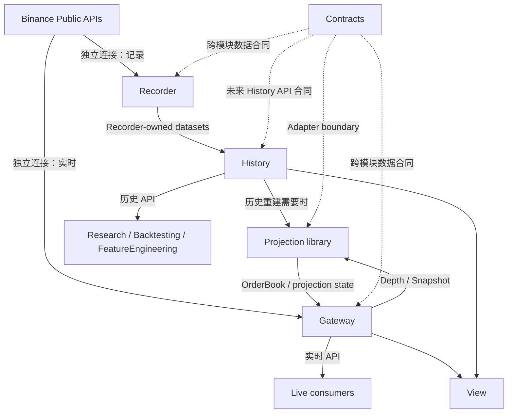

# BinanceMarketData 顶层持续架构

> **文档类型**：Living Architecture Document  
> **模块**：BinanceMarketData  
> **状态**：CURRENT TOP-LEVEL ARCHITECTURE（合并到 `main` 后生效）  
> **版本**：0.3.0  
> **最后更新**：2026-08-30  
> **用途**：定义 BinanceMarketData 大模块的长期职责边界、组件关系、数据流、依赖规则和开发方向。后续子项目不得在没有显式架构变更的情况下违反本文边界。

---

# 1. 一句话定义

`BinanceMarketData` 是量化交易系统中的 **Binance 公共市场数据子系统**。

它负责：

- 从 Binance 公共 REST / WebSocket 获取市场事实；
- 可靠记录并保存这些事实；
- 将深度事件确定性地投影为本地订单簿状态；
- 向实时消费者提供低延迟数据；
- 向研究、回测和界面提供可验证的历史查询；
- 暴露数据质量、完整性和运行状态事实。

它不负责：

- Alpha、预测模型或策略特征；
- 买卖信号；
- 风险审批；
- 账户、仓位、订单和下单；
- 投资组合管理；
- 交易 API Key 或交易权限。

最重要的边界：

```text
MarketData 告诉其他模块“市场发生了什么、现在是什么状态、数据是否可信”。
Feature / Strategy / Risk 决定“这些事实意味着什么、是否应该交易”。
```

---

# 2. 顶层组件

当前顶层只承认六个有明确名字的逻辑组件：

1. `BinanceMarketDataContracts`
2. `BinanceMarketDataRecorder`
3. `BinanceMarketDataProjection`
4. `BinanceMarketDataGateway`
5. `BinanceMarketDataHistory`
6. `BinanceMarketDataView`

其中前四个已经存在独立仓库；`History` 与 `View` 是后续明确需要的逻辑组件，但不要求现在立即建立独立仓库或服务。

`Health` 与 `Control` 当前定义为 **横切能力（capability）**，不是一级独立系统。只有真实规模和运维需求证明需要时，才允许升级为独立组件。

---

# 3. 最简系统关系



这张图必须这样理解：

- **Recorder 是录像机**：保存“Binance 当时到底发了什么”。
- **Projection 是计算库**：把 Snapshot + DepthUpdate 还原为“当前订单簿是什么”。
- **Gateway 是实时服务器**：连接 Binance、调用 Projection，并把实时结果提供给下游。
- **History 是历史查询层**：读取 Recorder 保存的数据；需要历史订单簿时可以复用 Projection。
- **下游消费者不把 Projection 当成网络服务使用。** Projection 是嵌入 Gateway / History 的共享语义引擎。

---

# 4. 实时数据到底怎么走

Gateway 有两条不同的实时输出路径。

## 4.1 事件路径

消费者想知道“Binance 刚刚发生了什么”：

```text
Binance
  -> Gateway transport/parser
  -> canonical market event
  -> SubscribeEvents
  -> consumer
```

典型数据：

- `DepthUpdate`
- `AggTrade`
- `BookTicker`

这条路径不要求事件先经过 Projection。

## 4.2 订单簿状态路径

消费者想知道“应用完这些变化后，现在订单簿是什么”：

```text
Binance
  -> Gateway
  -> ExchangeDepthSnapshot + ordered DepthUpdate
  -> embedded Projection
  -> LocalOrderBookSnapshot / accepted ordered updates
  -> Gateway publication
  -> SubscribeOrderBook
  -> consumer
```

因此：

> 下游连接的是 **Gateway**；
> 下游拿到的订单簿数据是 **Gateway 内部调用 Projection 后发布的结果**。

Projection 不拥有 socket、gRPC server、subscriber 或独立进程生命周期。

---

# 5. 组件职责

## 5.1 BinanceMarketDataContracts

### 作用

统一跨模块“说话方式”。

### 负责

- 公共数据类型与字段语义；
- Protobuf / Pydantic / schema；
- wire compatibility；
- 时间、标识、单位和 presence 语义；
- Gateway RPC contract；
- C++ message package；
- 独立的 C++ gRPC service/stub package。

### 不负责

- Binance 网络连接；
- order-book sequence 分类；
- Projection lifecycle；
- Recorder 存储；
- Gateway runtime；
- UI。

### 重要规则

Contracts 是跨模块合同 authority，但不是“所有内部代码都必须依赖的中央框架”。

例如：

```text
Projection Core        -> 不依赖 Protobuf / gRPC
Projection ProtoAdapter -> 可以依赖 Contracts message package
```

不得为了“统一”而让 Contracts 渗入各组件内部实现。

---

## 5.2 BinanceMarketDataRecorder

### 作用

Recorder 是 BinanceMarketData 的 **durable system of record**。

它回答：

> Binance 当时发送了什么？什么时候收到？来自哪条连接？有没有缺口？后来保存在哪里？

### 负责

- 独立 Binance Spot / USD-M 公共连接；
- exact Raw capture；
- receive/provenance/connection evidence；
- 有界 ingress 与 durable spool；
- Raw chunk / seal / manifest；
- Catalog；
- crash recovery；
- reconnect / gap durable evidence；
- archive 生命周期；
- normalize；
- replay；
- historical import；
- storage / capacity / operational evidence。

### 不负责

- 为 LiveStrategy 提供最低延迟实时行情；
- Gateway subscriber lifecycle；
- 对外实时 gRPC；
- strategy feature；
- trading。

### 关于 Recorder 内部订单簿

Recorder 可以保留自身用于 capture quality、gap/resync 和验证的内部 order-book 逻辑。

但是：

> Recorder 内部 order-book 实现不是跨模块 consumer-facing order-book authority。

对外实时 / 历史订单簿产品的共享语义 authority 属于 `BinanceMarketDataProjection`。

---

## 5.3 BinanceMarketDataProjection

### 作用

Projection 是一个 **strategy-independent、deterministic、replayable、single-writer 的嵌入式 C++ 库**。

它回答：

> 给我一个合法 baseline 和按顺序到达的 depth updates，确定性地告诉我订单簿和 sequence/lifecycle 状态是什么。

### 当前核心职责

- fixed-point numeric semantics；
- deterministic `OrderBook`；
- Spot sequence policy；
- USD-M sequence policy；
- stale / duplicate / bridge / gap classification；
- projection lifecycle；
- reset / resync semantics；
- optional Contracts `ProtoAdapter`；
- `LocalOrderBookSnapshot` construction。

### 明确不负责

- REST / WebSocket；
- Binance connection lifecycle；
- threads / scheduler；
- runtime queues；
- gRPC；
- persistence；
- subscriber management；
- strategy features。

### 部署原则

Projection 逻辑独立，但 Phase 1 不作为独立服务：

```text
Gateway embeds Projection  -> 实时订单簿
History embeds Projection  -> 历史重建
```

同样的有序输入和配置必须得到相同的确定性结果。

### 防止 Projection 膨胀

“可以确定性计算”并不意味着“应该塞进 Projection Core”。

当前 `BinanceMarketDataProjection` 不自动扩张为 OHLCV、trade tape、premium、funding composition、OBI、microprice 等万能派生计算框架。

任何新的 derived-data capability 必须单独证明：

1. 它是稳定的市场数据语义，而不是策略 feature；
2. 它确实需要成为共享 authority；
3. 它不会破坏当前狭窄、可验证的 Projection Core。

---

## 5.4 BinanceMarketDataGateway

### 作用

Gateway 是 BinanceMarketData 的 **低延迟实时 serving host**。

它回答：

> 实时消费者现在需要哪些 Binance 市场事件或订单簿状态，我如何以有界、可恢复、不会被慢消费者拖死的方式交付？

### 负责

- 独立 Binance REST / WebSocket；
- authoritative symbol metadata acquisition；
- receive timestamps；
- wire / transport parsing；
- connection identity / generation；
- bootstrap buffering；
- REST snapshot acquisition；
- reconnect / resync orchestration；
- planned connection rotation；
- bounded ingress / egress；
- serialized Projection scheduling；
- subscription admission；
- slow-consumer isolation；
- gRPC runtime；
- `gateway_instance_id` / `subscription_id` / `session_sequence`；
- realtime status/telemetry facts。

### 不负责

- 第二套 order book；
- 第二套 Spot / USD-M sequence classifier；
- durable Raw archive；
- historical persistence；
- strategy feature；
- trading。

### Gateway 与 Projection 的硬边界

Gateway **拥有 orchestration**；Projection **拥有 order-book semantics**。

```text
Gateway decides:
- 什么时候连接 / 重连
- 什么时候取 REST snapshot
- 怎么缓存
- 怎么排队
- 怎么发布

Projection decides:
- update 是 stale / duplicate / applied / gap
- book 如何确定性变化
- lifecycle / reset / resync semantics
```

Gateway 必须遵循 Projection 的分类结果，不得自己实现第二套 continuity authority。

---

## 5.5 BinanceMarketDataHistory

### 状态

未来明确需要；当前不要求立即形成独立服务或仓库。

### 作用

History 是 **历史查询 / serving layer**，不是第二个 Recorder。

它回答：

- 某时间区间有哪些事件？
- 某个数据集覆盖到哪里？
- 哪些区间存在 gap？
- 某个时刻的订单簿是什么？
- 这份历史结果来自哪些 Raw / dataset / code version？

### 数据来源

History 读取 Recorder-owned：

- Raw-derived normalized datasets；
- replay surfaces；
- checkpoints；
- manifests / lineage；
- dataset descriptors。

### 负责

- dataset discovery；
- time-range query；
- gap / coverage query；
- historical event query；
- point-in-time query；
- replay/query interface；
- lineage / version exposure；
- 必要时嵌入 Projection 重建历史 order book。

### 不负责

- 第二套 Raw persistence；
- 第二套 Catalog authority；
- 修改 Recorder 历史；
- 复制一套 order-book sequence semantics；
- strategy backtest logic；
- feature computation；
- realtime serving。

### 第一阶段部署原则

优先从 library / CLI / local query boundary 开始。

只有在跨进程、跨设备或并发 consumer 的真实需求出现后，才升级为独立 History service。

---

## 5.6 BinanceMarketDataView

### 状态

未来组件。

### 作用

给人看。

### 读取关系

```text
实时：View -> Gateway
历史：View -> History
状态：View -> 各组件公开 status/read API
```

### 可以展示

- 实时价格与订单簿；
- event / trade tape；
- 历史 timeline；
- point-in-time order book；
- gap / data-quality；
- Recorder storage/archive 状态；
- Gateway connection/subscription 状态；
- latency / resource / coverage 信息。

### 不负责

- 直接连接 Binance；
- 直接读取 Recorder SQLite / Raw；
- 自己重建订单簿；
- 自己定义 sequence semantics；
- strategy / trading。

浏览器协议转换属于 View Backend / BFF，不要求 Gateway 为浏览器改变核心 gRPC contract。

---

# 6. Health 与 Control：现在是能力，不是系统

## 6.1 Health / Observability

每个组件首先对自己的状态负责：

```text
Recorder -> Recorder health/status/metrics
Gateway  -> Gateway health/status/metrics
History  -> History health/status/metrics
View     -> View health/status
```

可报告：

- last event age；
- gap / resync；
- queue occupancy；
- connection state；
- subscriber count；
- latency；
- storage runway；
- archive backlog；
- process resources。

当前不建立独立 `BinanceMarketDataHealth` 服务。

如果未来出现多实例、多地域、大量运行组件，需要集中聚合时，再建立 Health aggregator。

### 与 Risk 的边界

MarketData 可以报告：

```text
STALE
GAP_PRESENT
NEEDS_RESYNC
UNAVAILABLE
```

但 MarketData 不决定：

```text
禁止开仓
减仓
停止交易
```

这些决定属于 `RiskManagement`。

---

## 6.2 Control

当前控制能力由各模块自己的 CLI / admin interface 提供，例如：

- Recorder start/stop/status/archive；
- Gateway start/stop/status/reconnect；
- History query/admin；
- diagnostic / validation commands。

当前不建立独立 `BinanceMarketDataControl` 服务。

只有出现真实的集中控制需求时才允许抽离。

任何 Control 都不得直接篡改其他模块的数据库或内部文件。

---

# 7. 数据层级

## L0 — Raw Source Evidence

Owner：Recorder。

内容：

- exact source payload；
- receive evidence；
- connection / provenance；
- durable gap / lifecycle evidence。

原则：不可变、可验证、可追踪。

---

## L1 — Canonical Market Events

Contract owner：Contracts。

典型对象：

- `DepthUpdate`
- `AggTrade`
- `BookTicker`
- `ExchangeDepthSnapshot`

Producer 可以是 Recorder adapter、Gateway parser/adapter 或 History adapter。

它表达：

> “市场发生了什么。”

---

## L2 — Deterministic Market State

Semantic owner：Projection。

当前核心产品：

- synchronized local order book；
- `LocalOrderBookSnapshot`；
- deterministic projection lifecycle/status。

它表达：

> “按统一规则应用市场事实后，市场状态是什么。”

`MarketStateSnapshot` 仍是较宽的未来 composition surface；当前架构不要求为了填满它而扩张 Projection。

---

## L3 — Strategy Features

Owner：FeatureEngineering。

例如：

- OBI；
- microprice variants；
- rolling imbalance；
- RSI / MACD；
- z-score；
- alpha factors；
- model features。

它表达：

> “这些市场事实对预测或策略意味着什么。”

不得反向塞回 MarketData core。

---

# 8. Live 与 Historical 必须共享语义

实时：

```text
Binance
 -> Gateway
 -> Projection
 -> OrderBook
```

历史：

```text
Recorder dataset
 -> History replay
 -> Projection
 -> historical OrderBook
```

目标 invariant：

> 同一合法 ordered input、相同 NumericSpec、相同 Projection configuration，live 与 replay 必须得到相同确定性 projection 结果。

这不要求 Recorder 现在重写为 C++ Projection；它要求 **consumer-facing projection semantics 只有一个共享 authority**。

---

# 9. 时间、标识与排序域

以下域必须分开，不得混用。

## 时间

- exchange event time；
- trade / transaction time；
- local receive wall time；
- monotonic runtime time；
- publish time；
- consumer receive time；
- historical replay / simulation clock。

不得使用一个含义模糊的 `timestamp` 代替所有时间。

## Sequence / identity

- Binance `U / u / pu`；
- Projection `last_update_id`；
- Gateway `connection_id`；
- Gateway `connection_generation`；
- `gateway_instance_id`；
- `subscription_id`；
- per-subscription `session_sequence`；
- Recorder storage / chunk / manifest identities。

这些值表达不同事实，禁止互相替代。

---

# 10. 可靠性与有界性原则

1. Recorder 与 Gateway 使用 **独立 Binance connections**。
2. Gateway 不依赖 Recorder 才能运行。
3. Recorder 不依赖 Gateway 才能记录。
4. 所有 runtime queue / buffer 必须有明确上限。
5. 慢消费者不得无限阻塞 Binance ingress、Projection mutation 或其他消费者。
6. contiguous delivery 不允许 silent drop。
7. continuity 一旦失去，必须显式 gap / terminate / resubscribe / rebootstrap。
8. 原始历史事实不可静默改写。
9. 派生数据必须可追踪到 source + schema + producer/build version。
10. 不因为“未来可能需要”提前引入 Kafka、Kubernetes、generic event bus、plugin framework、DI framework 或 lock-free infrastructure。

---

# 11. 部署模型

## 当前推荐

```text
Storage-oriented host:
    Recorder

Latency-oriented host:
    Gateway
      └── embedded Projection

Local/offline first:
    History
      └── embedded Projection when needed

Web/UI later:
    View + BFF

Contracts:
    package/schema, not runtime service
```

Recorder 与 Gateway 可以在不同机器上运行，并应保持独立 failure domain。

Projection 不需要单独部署。

History 是否最终独立服务由真实 consumer / concurrency / remote-query 需求决定。

---

# 12. 对整个量化系统的接口

## LiveStrategy

主要通过 Gateway：

```text
Gateway SubscribeOrderBook -> projected order book
Gateway SubscribeEvents    -> canonical realtime events
Gateway status              -> data/runtime facts
```

## FeatureEngineering

实时 feature 可以消费 Gateway；离线 feature 主要消费 History。

FeatureEngineering 可以把 MarketData 作为输入，但输出不属于 MarketData。

## StrategyResearch / Backtesting

主要通过 History / Replay，必要时复用 Projection 重建历史 order book。

不得直接依赖 Recorder 内部文件布局作为长期公共接口。

## RiskManagement

可以消费 MarketData 的 data-health facts，但交易允许/禁止决策由 RiskManagement 自己拥有。

## Execution / Portfolio

不属于 BinanceMarketData dependency core，不在本模块设计交易职责。

---

# 13. 当前实现映射（2026-08-30）

这部分只用于方向定位；具体 SHA、CI、运行状态以各仓库自己的 CURRENT_STATE / GitHub live state 为准。

## Contracts

- 公共 schema / Protobuf 已存在；
- C++ message package 已存在；
- separate C++ gRPC service/stub artifact 已存在；
- formal publication/release 仍是后续 release concern。

## Recorder

- 主要 capture/storage/archive/normalize/replay 能力已实现；
- 当前重点是 progressive long-running VPS validation；
- 尚未 Production Ready。

## Projection

- M0-M5 已完成；
- M6 real-Gateway integration acceptance 已完成；
- current core 继续保持 deterministic / single-writer / order-book / sequence / ProtoAdapter 边界；
- M6/G8 closure 不要求修改 Projection production Core。

## Gateway

- G0-G8 已完成；
- real Spot BTCUSDT network、recovery、rotation、bounded publication、`SubscribeOrderBook` 与 G8 Projection M6 integration acceptance 已存在；
- `NEXT=G9`：实现 `SubscribeEvents`。

## History / View

- 顶层职责已定义；
- 当前不应抢在 Gateway realtime surface 与 Recorder reliability 主线之前扩大实现范围。

---

# 14. 当前开发顺序

## 实时主线

```text
Gateway G8 complete / Projection M6 integration complete
  -> G9: SubscribeEvents
  -> G10: minimal GetGatewayStatus
  -> G11: USD-M + multi-market
```

### 已完成的 G8 / M6 integration gate

G8 已证明真实 Gateway + embedded Projection + `SubscribeOrderBook` 垂直切片可以作为完整 integration boundary 工作，并覆盖必要的 consumer-visible recovery / resync / planned-rotation 行为。

G8 的完成也确认了此前的顶层顺序判断：

> Projection M6 real-Gateway integration acceptance 不需要等待 G9 `SubscribeEvents` 或 G10 `GetGatewayStatus`。

当前 Projection/Gateway repository-local authority 已完成这一顺序对齐；后续开发从 G9 继续。

## Recorder 并行主线

继续长时间验证和正式 acceptance 准备；不要为了配合 Gateway 重构 Recorder runtime。

## 后续

实时核心和 Recorder 可靠性进一步收口后：

```text
History architecture/contract
 -> History MVP
 -> View
```

Health / Control 只有真实需求证明后才升级为独立组件。

---

# 15. 架构不变量

以下规则是后续开发的默认 gate。

- **MD-INV-01**：Recorder 与 Gateway 独立连接 Binance。
- **MD-INV-02**：Recorder 是 durable source of record。
- **MD-INV-03**：Gateway runtime 不依赖 Recorder。
- **MD-INV-04**：Projection 是 embedded deterministic library，不是网络服务。
- **MD-INV-05**：下游实时消费者连接 Gateway，不直接连接 Projection。
- **MD-INV-06**：consumer-facing order-book / sequence / gap semantics 由 Projection 单一拥有。
- **MD-INV-07**：Gateway 拥有 transport/orchestration，但不得创建第二套 Projection semantics。
- **MD-INV-08**：History 是 query/serving layer，不成为第二个 Recorder。
- **MD-INV-09**：View 是 consumer，不读取 Raw/Catalog internals，不实现 market semantics。
- **MD-INV-10**：Health / Control 当前是 capability，不是默认独立 service。
- **MD-INV-11**：所有 runtime queue/buffer 有界；silent continuity loss 禁止。
- **MD-INV-12**：不同 clock / sequence / identity domain 不混用。
- **MD-INV-13**：strategy-specific feature 不进入 MarketData Core。
- **MD-INV-14**：历史/派生产品必须保留 provenance 与 version identity。
- **MD-INV-15**：Live 与 historical replay 复用同一 consumer-facing Projection semantics。
- **MD-INV-16**：没有 measurement / concrete requirement，不引入通用框架和分布式基础设施。

违反这些 invariant 的实现必须先做明确的架构变更和 review，不能在 feature PR 中顺带改变。

---

# 16. 当前受控开放问题

| ID | 问题 | 当前方向 |
|---|---|---|
| O-001 | History 最终是 library 还是 service | 先 library/CLI；真实 remote/concurrency 需求出现再服务化 |
| O-002 | View 何时开发 | History API 和 Gateway realtime surface 足够稳定后 |
| O-003 | 是否需要独立 Health aggregator | 当前不需要；多实例/多地域规模出现后再评估 |
| O-004 | 是否需要独立 Control plane | 当前不需要；集中运维需求出现后再评估 |
| O-005 | `MarketStateSnapshot` 的最终 composition | deferred；不为填 schema 强迫 Projection 膨胀 |
| O-006 | OHLCV / tape / premium 等 deterministic derived data 放哪里 | 逐项设计；“可确定性计算”本身不足以进入 Projection Core |
| O-007 | Contracts formal release / package revision | release concern；当前不是 Gateway/Projection engineering blocker |
| O-008 | Recorder-local quality orderbook 与 consumer-facing Projection 的长期语义对齐 | 保持职责隔离；任何统一必须另行设计和验证，不自动重写 Recorder |

---

# 17. 文档与架构治理

## Authority scope

本文是 **BinanceMarketData 跨仓顶层边界与开发方向 authority**。

它不替代：

- Binance 官方协议事实；
- 各仓库内部算法 / lifecycle ADR；
- Contracts wire schema；
- Recorder durable-format/storage contracts；
- Projection sequence semantics；
- Gateway runtime milestone acceptance。

当顶层边界与旧的 repository-local 文档发生冲突时：

1. 不允许静默选择；
2. 先确认哪份是更新的有效 authority；
3. 在开始受影响 milestone 前完成文档对齐；
4. 涉及 public schema / persistent format / sequence semantics 的变化必须走对应 repo 的正式 ADR / compatibility review。

## 何时必须更新本文

- 新增 / 删除一级组件；
- 组件 ownership 变化；
- Gateway / Recorder / Projection / History 依赖方向变化；
- consumer-facing data flow 变化；
- Health / Control 升级成独立系统；
- MarketData 与 Feature/Strategy/Risk 边界变化；
- 部署 failure domain 发生重大变化。

## 不应该写进本文的东西

- 某一次 CI run 细节；
- 某个 temporary SHA 的执行记录；
- 具体 bug forensic；
- 实现函数级说明；
- 可以在 repo-local CURRENT_STATE / MILESTONES / evidence 中维护的短期状态。

---

# 18. 给新开发者的一分钟版本

```text
Contracts  = 大家交换数据时使用的公共语言。
Recorder   = 录像机：把 Binance 历史事实可靠保存下来。
Projection = 计算库：把 Snapshot + DepthUpdate 确定性还原成订单簿。
Gateway    = 实时服务器：连接 Binance，调用 Projection，向下游提供实时事件和订单簿。
History    = 历史查询层：读取 Recorder 数据，需要时调用 Projection 重建历史订单簿。
View       = 给人看的界面：实时看 Gateway，历史看 History。

Health / Control = 目前是各模块自己的能力，不是新建两个系统。
```

如果一个新功能不知道放哪里，先问：

```text
它是在记录事实？          -> Recorder
它是在定义公共数据语义？  -> Contracts
它是在确定性重建订单簿？  -> Projection
它是在实时连接和交付？    -> Gateway
它是在查询历史？          -> History
它是在展示？              -> View
它是在构造预测/策略输入？  -> FeatureEngineering，不属于 BinanceMarketData Core
```